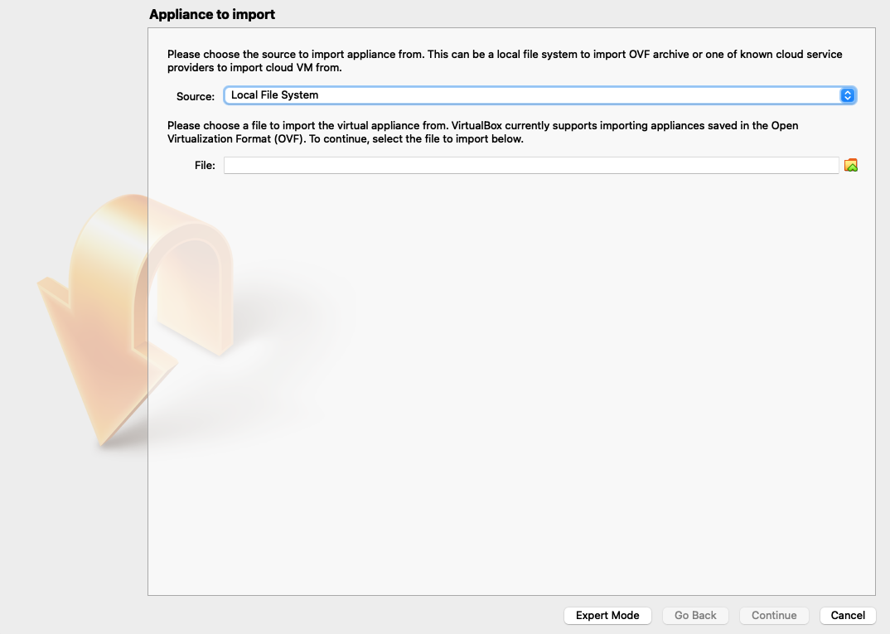
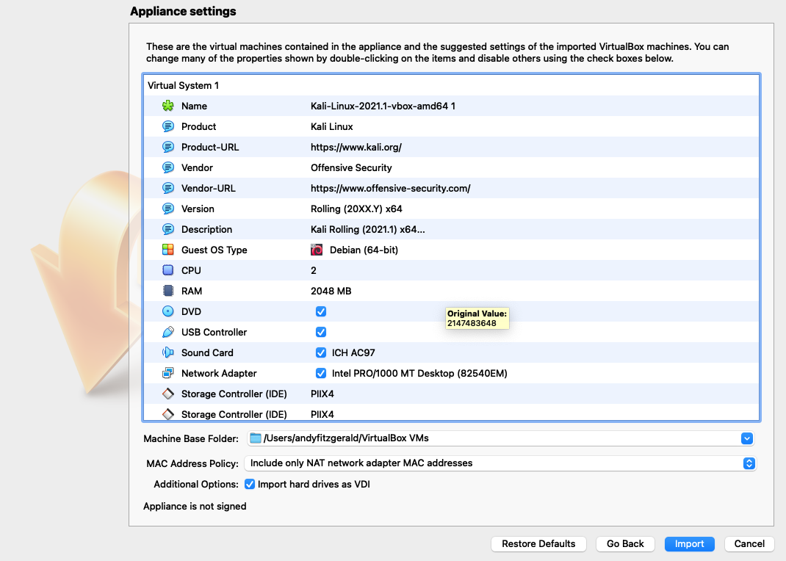

## Kali Linux Windows Installation Guide (2021)

The easiest way to install Kali linux is using a virtual machine. Dual booting can also be used but its messy and can lead to problems. VMs are easier to install. 

### Install VirtualBox

Go to https://www.virtualbox.org/wiki/Downloads and choose the Windows host download link. It should start do download automatically.

### Download the Kali Image

A Kali Linux image can be downloaded from the https://www.kali.org/get-kali/#kali-virtual-machines. Select the VirtualBox Image and wait it to download. The file is over 3GB so it may take some time - depending on your broardband speed. 

### Installation

Install VirtualBox first. Find the downloaded file and double click to initialise the installation. Follow the onscreen instructions and once installed open up Virtual Box. 

### Import the Kali Image

Next, we need to import the Kali Image OVA file. In VirtualBox Select the Import Icon and the following popup should appear:

Locate the ova file you downloaded previously and then click on Continue. 

Application settings shows the defaults being applied. Leave as it, click Import and wait for it to finish.
